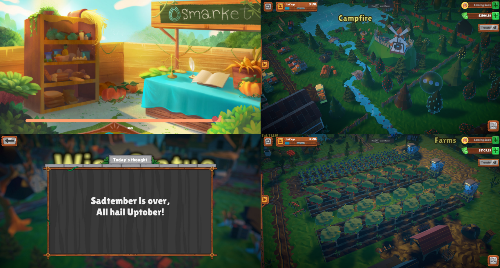

# Gamified DeFi Land - Free to Play

DeFi Land is completely free. By connecting your wallet to DeFi Land, you are able to swap crypto tokens, manage your portfolio, and learn about DeFi in a fun and engaging manner.

With Education Mode, newcomers are able to practice and learn more about the industry without having to spend any of their actual funds. Beginners  are provided the opportunity to grasp how DeFi in a hands-on platform.

When you log in for the first time, you can take advantage of DeFi Land's has a referral program. Simply share your referral's wallet address when signing in for the first time, and they will earn rewards based on your activities in the game.
